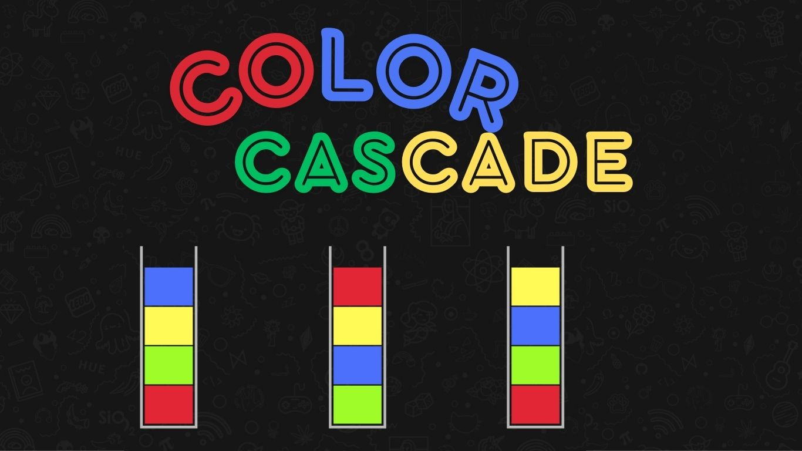
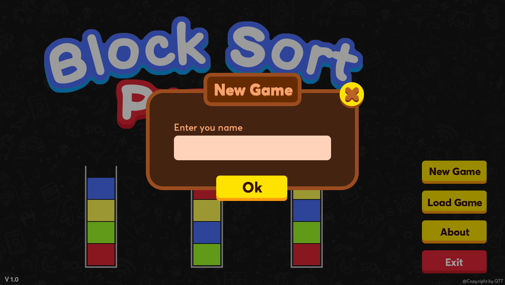
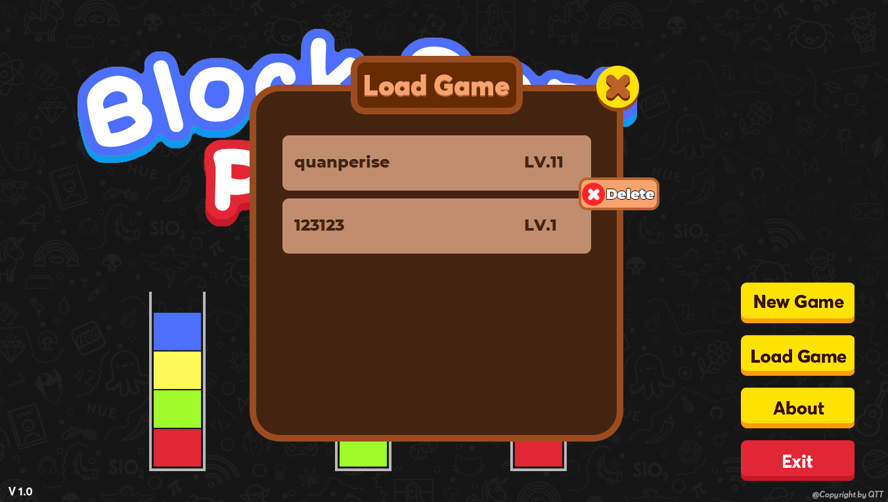
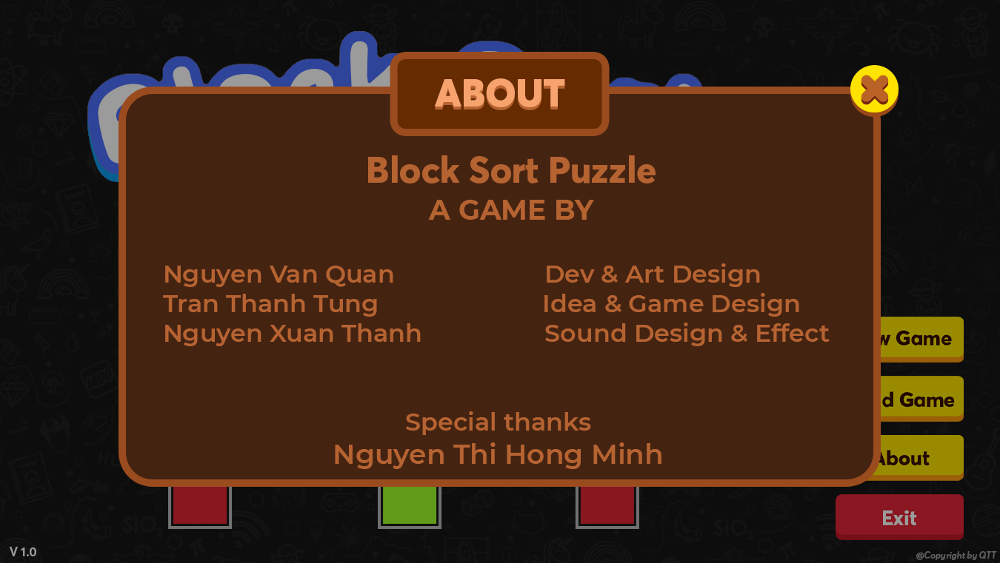
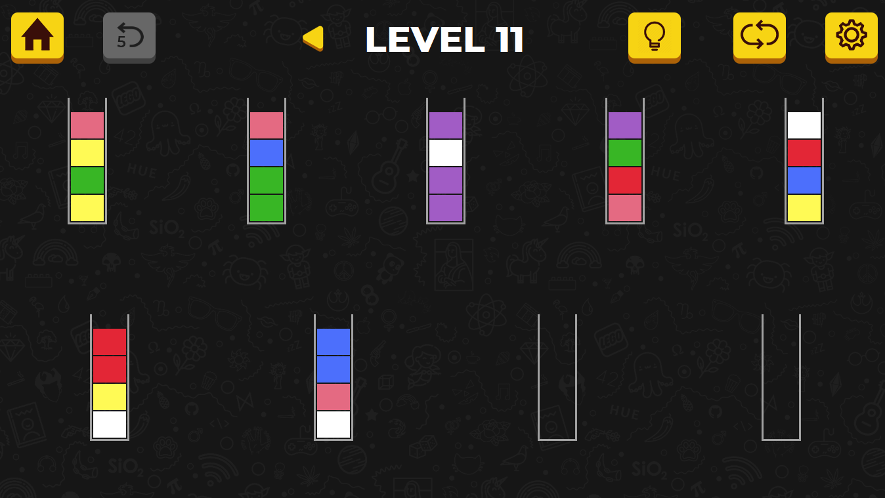
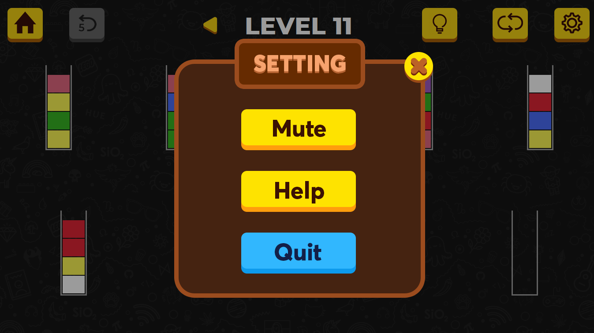

# Color Cascade

## Introduce
**Color Cascade** is a fun and addictive puzzle game!Try to sort the colored block in the tubes until all colors in the same tube. A challenging yet relaxing game to exercise your brain!

The game has **5 levels** with different difficulty levels in each level.

## How to play
* Drag and drop any block at the top of the tube to another tube. 
* The rule is that you can only drag block if it is linked to the same color and there’re enough space on the tube.
* Try not to get stuck - but don’t worry, you can always restart the level at any time.

## Features

* Multiple unique level.
* FREE & EASY TO PLAY.
* Save your own data after each level.
* Time limits; you can enjoy Color Cascade at your own pace!
* Give a solution.

## Data Structure

* Each tube is a stack with size = 4.
* Each level is a List containing the tubes.
* Undo feature using Linked List.

## Some Image of Game

### Home Screen



#### New Game



#### Load Game



#### About Game



### Play Screen



#### Setting 




## Directory Structure

```txt
TSP/
  data/              contains data of user in game
  image/             contains images to introduce game
  lib/               contains library AbsoluteLayout.jar to support build graphic
  problem/           contains levels and solutions folder
  resource/          contains drawable, fonts and sounds folder
  src/               contains source code
```

## Installation

### Clone repository
First, you need to download the repository. You can either run the script below on the command-line or terminal:

`git clone https://github.com/quanpersie2001/water-sort-java-swing.git`

or download zip file of repository and unzip.

If you have the problem related to personal access token, try following the steps below:
- Log in to your GitHub account
- Go to `Settings`, then choose `Developer Settings`
- Choose `Personal access tokens`
- Generate and copy your tokens
- Clone again and paste tokens to password space

### Run

Run file `src/Main.java` 

